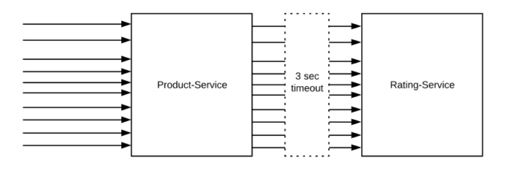
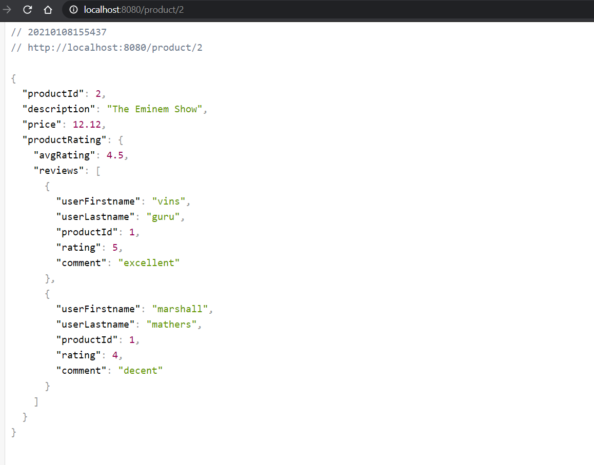
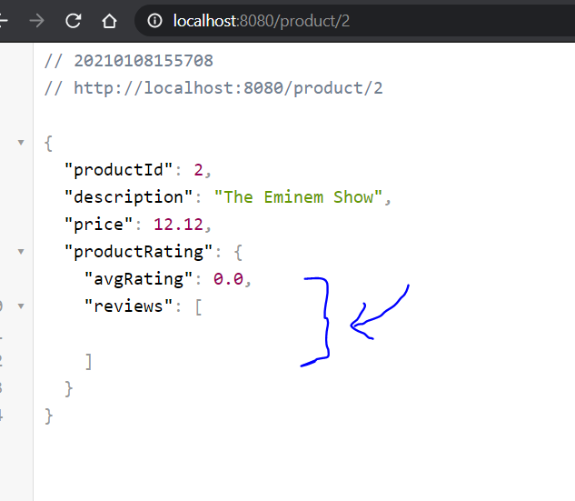

# Timeout Pattern Microservices

Repositori ini merupakan hasil experiment penulis dalam timeout pattern dalam sebuah microservices environtment.

Dalam percobaaan ini, akan disimulasikan terjadi request ke product service yang mana product service ini mempunyai dependensi ke rating service untuk mengambil data rating dari sebuah product. Dan dalam experiment ini kita juga akan mensimulasikan jika Rating Service ini sedang UP dan juga sedang Down dalam sekali request.

#### **Prerequisites**

Sebelum mencoba repo ini pastikan local anda sudah terinstall :

1. OpenJDK 11
2. Inteljidea atau Spring Tool Suite as IDE

#### Stack

1. Spring Boot
2. Lombok
3. Resilent4j

#### **Cara Penggunaan**

- Running Product Service
- Running Rating Service

kemudian akses di browser  dengan url sebagai berikut

http://localhost:8080/product/1

http://localhost:8080/product/2

Jika dalam simulasi ini rating service sedang UP maka response akan sebagai berikut

namun jika dalam simulasi ini service Rating sedang DOWN makan response akan sebagai berikut

